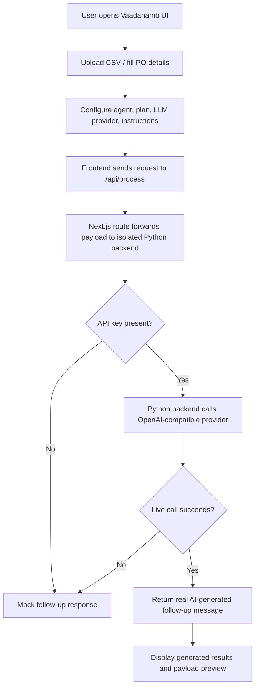

# Vaadanamb Procurement Agent

Vaadanamb is a procurement follow-up agent prototype built to help teams configure a supplier coordination workflow, upload CSV-based purchase order data, and generate follow-up messages using either mock demo logic or a real LLM provider when an API key is available.

## Problem statement

Procurement teams often need to coordinate with suppliers, track pending acknowledgements, and send timely follow-up reminders. A lot of this work is repetitive and manual, especially when teams must review purchase orders, check supplier records, and prepare consistent follow-up messages.

Vaadanamb addresses this by giving teams a simple interface to:

- configure the agent name, role, instructions, and workflow mode
- upload CSV or text data for a purchase order and supplier context
- choose the LLM provider and model
- generate follow-up messages for suppliers
- switch between free/demo mode and premium-style mock mode

## Solution overview

Vaadanamb combines a Next.js frontend with an isolated Python backend inside the same repository.

The application supports two modes:

1. Mock mode
   - useful for demo purposes
   - works without any API key
   - returns structured mock follow-up data

2. With-token mode
   - uses a real OpenAI-compatible provider such as OpenAI, Azure OpenAI, or OpenRouter
   - requires an API key and provider settings in the LLM configuration UI
   - keeps the mock response as a fallback when no token is present or the live call fails

## Technologies used

- Next.js 14
- React 18
- TypeScript
- Python 3.13
- FastAPI
- Uvicorn
- HTTPX
- OpenAI-compatible API integration
- CSV upload parsing for demo PO data

## Architecture / workflow diagram



## Features

- configure agent information, workflow mode, supplier details, and follow-up policy
- upload CSV or text files to auto-fill purchase-order fields
- switch between free demo and premium mock plans
- choose provider, model, base URL, and API key
- preview generated payloads and output results
- run in mock mode by default for easy demos
- support real OpenAI-compatible generation when a token is provided

## Repository structure

- `app/` - Next.js frontend pages and UI logic
- `app/api/process/route.ts` - main processing route used by the frontend
- `backend/server.py` - isolated Python FastAPI server for Vaadanamb
- `backend/requirements.txt` - Python backend dependencies
- `backend/.gitignore` - backend-specific ignore rules

## Setup and run instructions

### 1. Install frontend dependencies

```bash
cd vaadhanaam
npm install
```

### 2. Install backend dependencies

```bash
cd vaadhanaam
python3 -m pip install -r backend/requirements.txt
```

### 3. Start the isolated Python backend

```bash
cd vaadhanaam
python3 -m uvicorn backend.server:app --host 127.0.0.1 --port 8000
```

### 4. Start the frontend

```bash
cd vaadhanaam
npm run dev
```

### 5. Open the app

- Frontend: http://localhost:3001
- Backend health check: http://127.0.0.1:8000/health

## With-token option

To use real AI generation:

1. open the LLM configuration section in the Vaadanamb UI
2. select a provider such as OpenAI, Azure OpenAI, or OpenRouter
3. enter the API key and base URL
4. choose a model
5. run the agent

If the key is missing or the provider call fails, the system automatically falls back to the existing mock logic.

## Sample CSV format

The upload feature expects a CSV with headers such as:

```csv
po_number,supplier,item,quantity,order_date,required_delivery_date,status,priority,production_impact,alternative_supplier
PO-10245,ABC Components,Industrial Bearings,5000 units,2026-09-09,2026-09-15,Awaiting acknowledgement,Critical,High,No
```

## Team members

- Aravindhraam
- Raam (GitHub: raam2003)

## Notes

This repository is organized so that the Vaadanamb project remains isolated in the `vaadhanaam` folder, with its own Python backend inside `backend/`.

## Future enhancements

- add persistent storage for saved agent configurations
- add authentication and plan-based access control
- add richer tool orchestration capabilities
- add export/download support for generated follow-up messages
